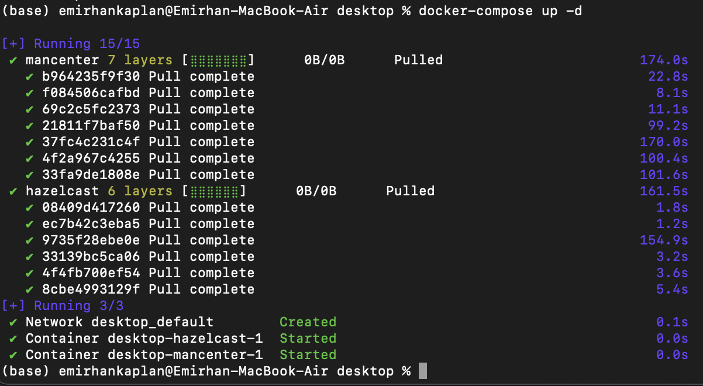
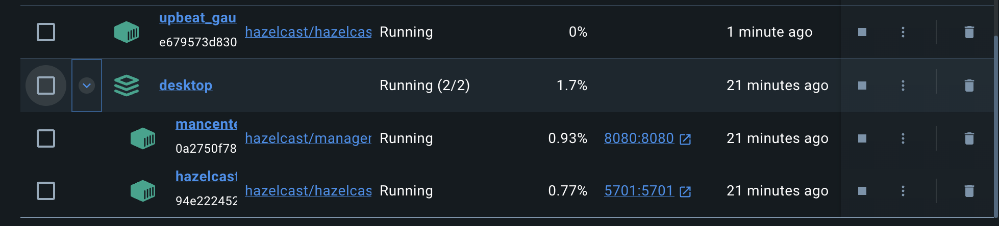
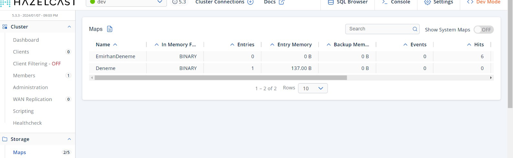

# Hazelcast IMap Example (Java + Docker)

Stores and reads back **10,000 objects** in a distributed Hazelcast `IMap`, with a Hazelcast member and **Management Center** running in Docker for monitoring.

## 📦 What's inside

`Hazelcast/HazelcastExample/src/main/java/com/mycompany/hazelcastexample/Person.java`

1. Starts an embedded Hazelcast member
2. Puts 10,000 `Person` objects into the distributed map `persons`
3. Reads every entry back and prints it
4. Shuts the member down

## 🧰 Tech stack

Java 11 · Maven · Hazelcast 5.3.6 · Docker · Hazelcast Management Center

## 🚀 Running it

```bash
cd Hazelcast/HazelcastExample
mvn compile exec:java -Dexec.mainClass=com.mycompany.hazelcastexample.Person
```

### Optional: Hazelcast and Management Center in Docker

```bash
docker network create hazelcast-network

docker run -d --name hazelcast --network hazelcast-network \
  -p 5701:5701 hazelcast/hazelcast:5.3.6

docker run -d --name management-center --network hazelcast-network \
  -p 8080:8080 hazelcast/management-center
```

Open Management Center at <http://localhost:8080> and add a cluster connection to `hazelcast:5701` to browse the maps.

## 📸 Screenshots

**Starting Hazelcast and Management Center with Docker Compose**



**Containers running in Docker Desktop**



**Maps in Hazelcast Management Center**


